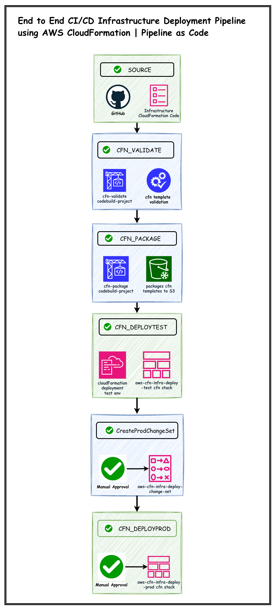
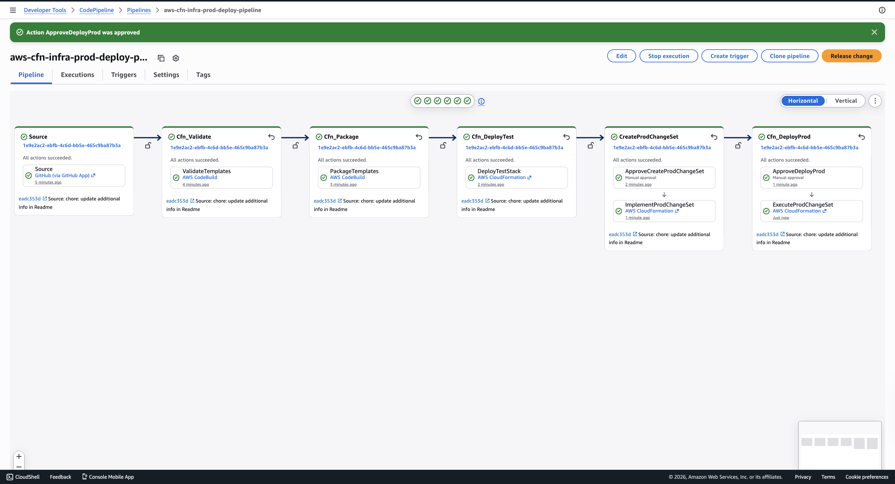

# AWS CloudFormation Infrastructure Deployment Pipeline

This repository contains a production-style CI/CD deployment pipeline built entirely using AWS CloudFormation.

The pipeline automates validation, packaging, deployment, approval workflows, and change management for the infrastructure defined in the companion repository **aws-cfn-two-tier-multi-environment** - https://github.com/vignesh-aws-devops/aws-cfn-two-tier-multi-env-cfn-stack

---

## Pipeline Overview

The deployment pipeline provisions and manages the following AWS services:

### Source

🔷 GitHub Repository Integration

🔷 AWS CodeConnections

---

### Build

🔷 CloudFormation Template Validation

🔷 CloudFormation Template Packaging

🔷 Build Automation using AWS CodeBuild

---

### Deployment

🔷 Automated Test Environment Deployment

🔷 Production Change Set Creation

🔷 Manual Approval before Production

🔷 Production Change Set Execution

---

### Security

🔷 AWS CodePipeline Service Role

🔷 AWS CodeBuild Service Role

🔷 CloudFormation Execution Role

🔷 IAM Least Privilege Access

---

### Storage

🔷 Amazon S3 Artifact Bucket

🔷 Packaged CloudFormation Templates

---

### Pull Request Validation

This solution also provisions a dedicated CodeBuild Project for Pull Request validation.

Every Pull Request automatically triggers:

✔ CloudFormation Template Validation

✔ GitHub Build Status Check

This prevents invalid CloudFormation templates from being merged into the main branch.

---

## Pipeline Architecture





## Pipeline Architecture

```
GitHub Repository
        │
        ▼
Source Stage
(CodeConnections)
        │
        ▼
Validate Stage
(CodeBuild)
        │
        ▼
Package Stage
(CodeBuild)
        │
        ▼
Deploy Test
(CloudFormation)
        │
        ▼
Manual Approval
        │
        ▼
Create Production Change Set
        │
        ▼
Manual Approval
        │
        ▼
Execute Production Change Set
        │
        ▼
Production Environment
```

---

## Repository Structure

```
.
├── pipeline.yaml
├── nested_artifact_bucket.yaml
├── nested_cloudformation_execution_role.yaml
├── nested_codepipeline_role.yaml
├── nested_codebuild_role.yaml
├── nested_codebuild_validate.yaml
├── nested_codebuild_package.yaml
├── nested_codebuild_pr_validate.yaml
├── validate_pipeline.sh
├── package_pipeline.sh
├── deploy_pipeline.sh
└── README.md
```

---

## Pipeline Components

### Artifact Bucket Stack

Responsible for provisioning the Amazon S3 bucket used to store pipeline artifacts and packaged CloudFormation templates.

---

### CodeBuild Role Stack

Creates the IAM Service Role used by all CodeBuild projects.

---

### CodePipeline Role Stack

Creates the IAM Service Role used by AWS CodePipeline.

---

### CloudFormation Execution Role Stack

Creates the IAM Role assumed by CloudFormation during infrastructure deployment.

---

### Validate Project

Validates every CloudFormation template before packaging.

---

### Package Project

Packages Nested Stack templates and uploads them to Amazon S3.

---

### Pull Request Validation Project

Automatically validates CloudFormation templates whenever a Pull Request is created or updated.

---

## Companion Infrastructure Repository

The deployment pipeline deploys the infrastructure contained in:

**aws-cfn-two-tier-multi-environment** - https://github.com/vignesh-aws-devops/aws-cfn-two-tier-multi-env-cfn-stack

---

## Deployment Flow

1. Source
2. Validate Templates
3. Package Templates
4. Deploy Test Environment
5. Manual Approval
6. Create Production Change Set
7. Manual Approval
8. Execute Production Deployment

---
